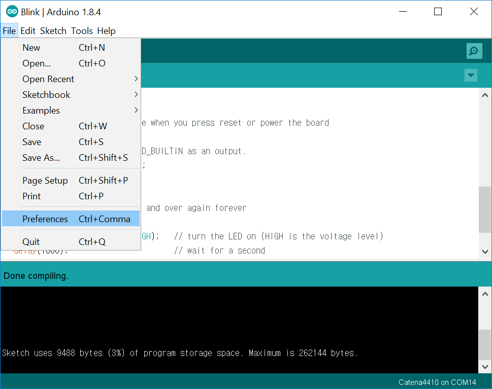
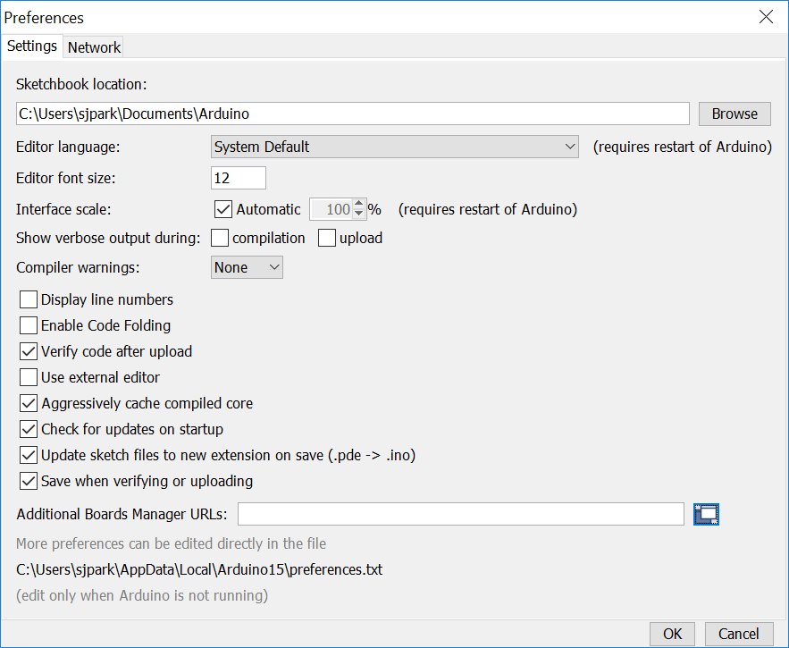
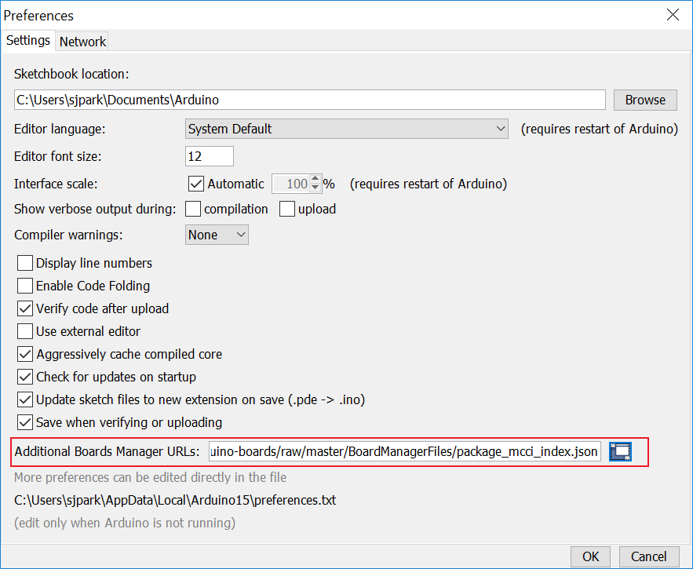
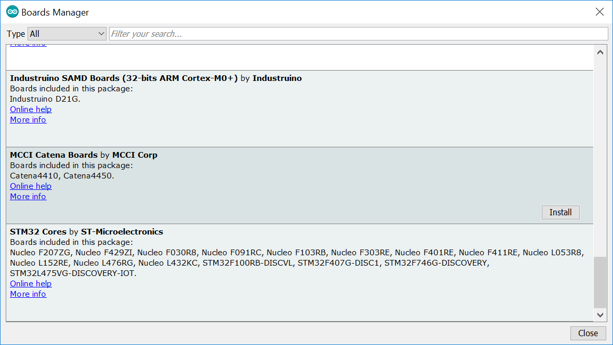
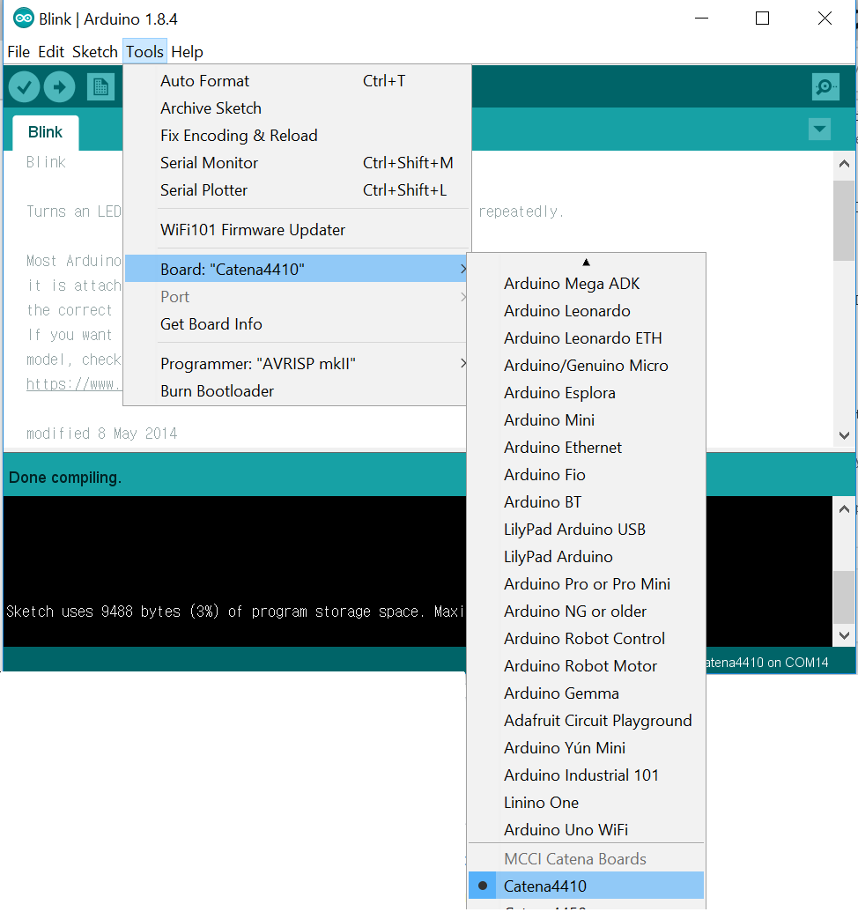
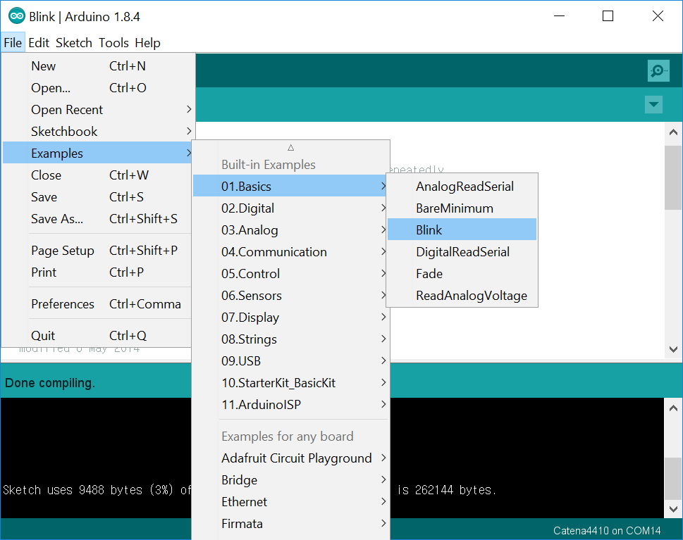
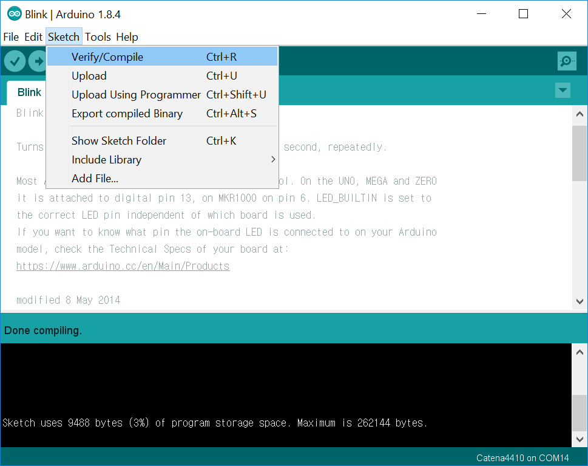

# MCCI Arduino Boards Package Repository

This repository contains the Boards Manager file(.json) and the related packages for Arduino IDE.

In order to successfully build and upload/test the code to the Catena boards, please follow these steps:

1. Download and install latest release of Arduino IDE (https://www.arduino.cc/en/Main/Software).
2. Install MCCI Catena BSP using the .json file.
3. Build and upload/Test.

## Installing the MCCI Catena BSP

Start Arduino IDE and navigate to `File>Preferences` menu.

The follwing window will pop up.

A URL will be added to **Additional Boards Manager URLs** option. If more than one URL is needed, each URL is separated with a comma(`,`). New MCCI boards and updates to existing boards will automatically be picked up by the Board Manager each time it is opened. The URLs point to index files that the Board Manager uses to build the list of available & installed boards.

In this example, only MCCI board .json file URL will be added, example, but you can add multiple URLS by separating them with commas. 

Copy and paste the link below into the Additional Boards Manager URLs option in the Arduino IDE preferences.

For production releases, use the following:
`https://github.com/mcci-catena/arduino-boards/raw/master/BoardManagerFiles/package_mcci_index.json`

For alpha releases, use the following:
`https://raw.githubusercontent.com/mcci-catena/arduino-boards/alpha/BoardManagerFiles/package_mcci_index.json`

For beta releases:
`https://raw.githubusercontent.com/mcci-catena/arduino-boards/beta/BoardManagerFiles/package_mcci_index.json`

After adding the URL, go to `Tools>Board:--->Boards Manager...` and install MCCI Catena Boards.

*Note: unlike the Adafruit BSP, there’s no need to install the Arduino SAMD tools; this kit takes care of all that.*

## Build and Download

Shutdown the Arduino IDE and restart it, just in case.
Ensure selected board is 'Catena4410'/'Catena4450'/'Catena4460' (in the GUI, check that `Tools`>`Board "..."` says `"Catana4410"/"Catena4450"/"Catena4460"`.

For testing, you can choose `File>Examples>01.Basics>Blink`

Follow normal Arduino IDE procedures to build the sketch: `Sketch`>`Verify/Compile`.

and `Sketch>Upload`.

If the code builds and upload successfully, go on and test the other sketches for the boards.
